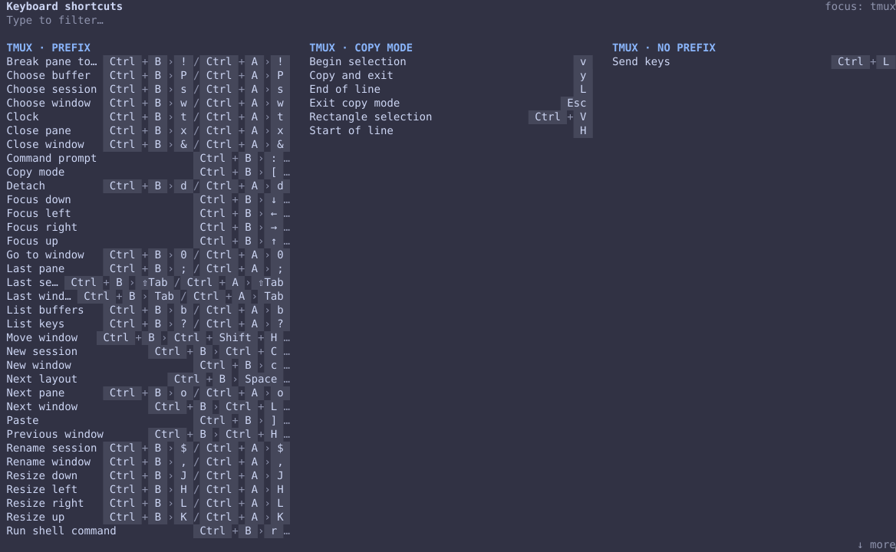
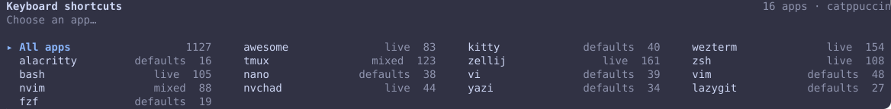

<div align="center">

# cst

**Every keyboard shortcut you have, on one screen.**

A fast terminal cheatsheet that reads the *live* keybindings of your window manager,
terminals, multiplexers, shells, editors and tools — custom ones included — in the style of an
awesome WM popup.

[](https://github.com/13/cst/actions/workflows/ci.yml)
[](https://github.com/13/cst/releases/latest)
[](https://aur.archlinux.org/packages/cst-bin)
[](LICENSE)


<br>


</div>

## Features

- **Your real bindings** — reads each app's config or asks the running app, then layers
  it over sensible defaults. Rebind something and `cst` shows the new key.
- **Type to filter** — rows that don't match dim instead of disappearing, so nothing jumps.
- **One app at a time** — pick one from the start screen, `cst tmux`, or Tab through apps inside the sheet.
- **Looks like your desktop** — colours come from your active awesome theme
  (falls back to Catppuccin); truecolor, 256 colours or `NO_COLOR`.
- **Fast and small** — one static binary, no runtime dependencies, starts in about 100 ms (most of it your shell's own startup for the zsh/bash sheets).
- **Never breaks on a bad config** — a broken file shows a ⚠ note and falls back to defaults.

## Supported apps

| App | Where the keys come from |
|---|---|
| awesome | the running WM (`awesome-client`), else `~/.config/awesome/keys.lua` |
| kitty | `kitty.conf` (+ includes, `kitty_mod`) over kitty's defaults |
| wezterm | `wezterm show-keys` (your effective key tables) |
| alacritty | `alacritty.toml` (+ imports) over alacritty's defaults |
| tmux | the running server (`list-keys`, `-N` notes), else `~/.tmux.conf` over tmux's defaults |
| zellij | the `keybinds` block of `config.kdl` (honours `clear-defaults`) |
| zsh | the live line editor (`bindkey`): insert and, in vi mode, normal keymap |
| bash | the live readline bindings (`bind -p`), emacs or vi |
| fish | the live `bind` table (fish 3 and 4 notations), per mode |
| nushell | reedline defaults plus `$env.config.keybindings` |
| readline | `~/.inputrc` (or `$INPUTRC`) over readline's defaults — shown when you have one |
| nano | `bind`/`unbind` in `/etc/nanorc`, `~/.nanorc`, `~/.config/nano/nanorc` over nano's defaults |
| vi | a classic-vi command reference (hidden when `vi` is really vim or nvim) |
| vim | vim's essential commands plus your own mappings (`:map` / `:imap`) |
| nvim | mappings with a description (read after startup, so plugins' maps are included) over core motions |
| NvChad | NvChad's own mappings, sectioned like its cheatsheet (Telescope, Terminal, NvimTree…) |
| micro | `~/.config/micro/bindings.json` over micro's defaults |
| emacs | a reference of the default keys |
| yazi | `keymap.toml` over yazi's defaults |
| lazygit | `keybinding:` in `config.yml` over lazygit's defaults |
| fzf | `--bind` in `FZF_DEFAULT_OPTS` / `FZF_DEFAULT_OPTS_FILE` |

Apps that aren't installed are skipped. `cst --list` shows what was found and where each
app's keys came from (`live`, `defaults` or `mixed`).

## Install

**Arch Linux (AUR)**

```sh
yay -S cst-bin        # or paru -S cst-bin
```

**Arch Linux (package from the release page)**

```sh
gh release download -R 13/cst -p 'cst-bin-[0-9]*-x86_64.pkg.tar.zst'
sudo pacman -U cst-bin-[0-9]*-x86_64.pkg.tar.zst
```

(or download `cst-bin-<version>-1-x86_64.pkg.tar.zst` from the
[latest release](https://github.com/13/cst/releases/latest) in a browser)

**Any x86_64 Linux (one line)**

```sh
curl -fsSL https://raw.githubusercontent.com/13/cst/main/install.sh | bash
```

Installs the static binary into `~/.local/bin` (`--system` for `/usr/local/bin`,
`--version v0.1.0` for a specific release). Uninstall with the same script:

```sh
curl -fsSL https://raw.githubusercontent.com/13/cst/main/install.sh | bash -s -- --uninstall
```

**From source**

```sh
cargo install --git https://github.com/13/cst
```

## Usage

```sh
cst            # pick an app (sorted by name)
cst tmux       # straight to one app
cst --list     # detected apps and where their keys come from
```

In the picker: type to filter, arrows or `Tab` to move, `Enter` to open, `Esc` to go back
from a sheet or to quit.

| Key | Action |
|---|---|
| type | filter (non-matching rows dim) |
| a shortcut (`Ctrl+B`, `Alt+←`, `F5`…) | look it up: rows using it stay lit (shown, not run) |
| `<tab>`, `<s-tab>`, `<cr>`, `<esc>`, `<up>`, `<c-a>`… | look up a key typed in vim notation — for keys `cst` uses itself |
| `Backspace` | delete a character, or clear the lookup |
| `Tab` / `Shift+Tab` | focus the next / previous app |
| `↑` `↓` `PgUp` `PgDn` `Home` `End` | scroll |
| `Esc` | clear the filter or lookup; with nothing to clear go back to the picker (or quit) |
| `Ctrl+C` `Ctrl+C` | quit (press twice within a second; once looks up Ctrl+C) |

In terminals that speak the kitty keyboard protocol (kitty, foot, alacritty, wezterm with
`enable_kitty_keyboard = true`) `cst` turns it on, so
`Ctrl+Shift+T` and `Ctrl+T` (or `Ctrl+I` and `Tab`) are told apart. Shortcuts your terminal
handles itself (kitty's `Ctrl+Shift+T` opens a tab) never reach `cst`.

## Theming

`cst` reads the active theme of [awesome](https://awesomewm.org)
(`~/.cache/awesome/theme`, else `config.default_theme` in `config.lua`) and uses its
infocard colours, so the sheet matches your desktop's cheatsheet popup. Without awesome
it uses Catppuccin Mocha. Colours are truecolor when `COLORTERM=truecolor`, 256 colours
otherwise, and off when `NO_COLOR` is set.

## How it works

Each app is a *source*: it reads the live config (files, or commands like
`wezterm show-keys` with a 1 s timeout), turns every notation (`ctrl+shift+t`, `C-a`,
`<C-w>`, `Ctrl g`) into the same key names, and layers the result over bundled defaults —
a live binding replaces the default on the same key, an unbind removes it. All sources
load in parallel; a failing or slow source (over 1 s) is skipped with a ⚠ note instead of
blocking the others.

## Contributing

```sh
cargo test                       # unit tests, fixtures, layout snapshots
cargo clippy --all-targets -- -D warnings
scripts/test-install.sh          # installer (after cargo build --release)
```

Adding an app is one file in `src/sources/`, a defaults list in `src/defaults/` and a
fixture in `tests/fixtures/`; see `src/sources/kitty.rs` for a small example.
Releases: see [docs/RELEASING.md](docs/RELEASING.md).

## License

[MIT](LICENSE)
